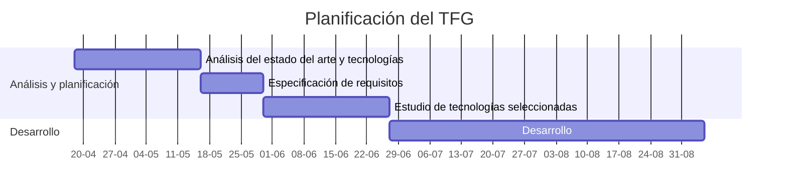
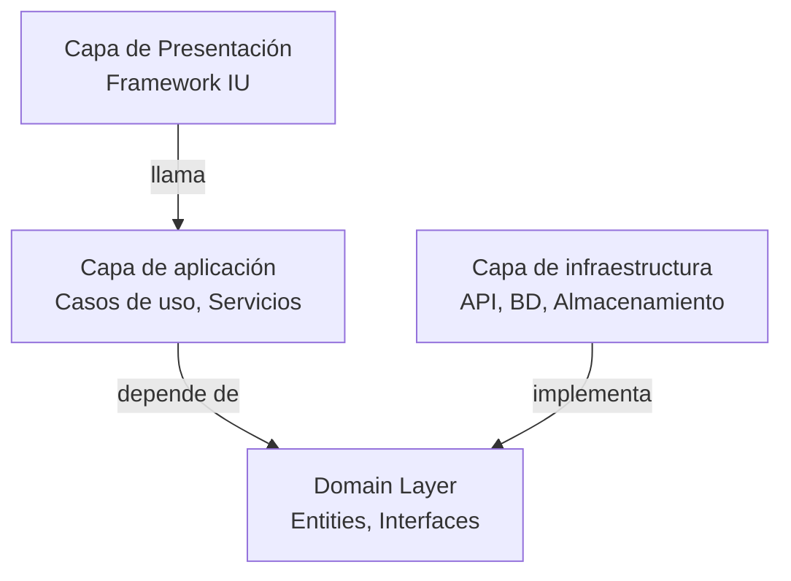

```mermaid
gantt
    title Planificación del TFG
    dateFormat  YYYY-MM-DD 
    axisFormat  %d-%m
    todayMarker off
    section Análisis y planificación
    Análisis del estado del arte y tecnologías      :a1, 2025-04-18, 4w
    Especificación de requisitos        :a2, after a1, 2w
    Estudio de tecnologías seleccionadas:a3, after a2, 4w
    section Desarrollo
    Desarrollo                          : a4, after a3, 10w

```

```mermaid
graph TD

A[Capa de Presentación<br/>Framework IU]
B[Capa de aplicación<br/>Casos de uso, Servicios]
D[Capa de infraestructura<br/>API, BD, Almacenamiento]
C[Domain Layer<br/>Entities, Interfaces]

A -->|llama| B
B -->|depende de| C
D -->|implementa| C
```
