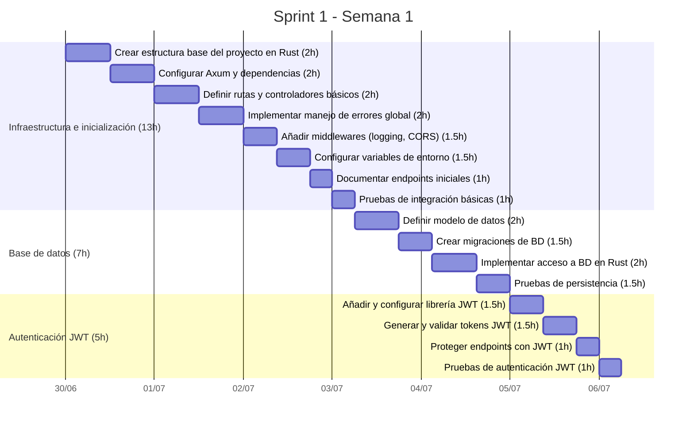
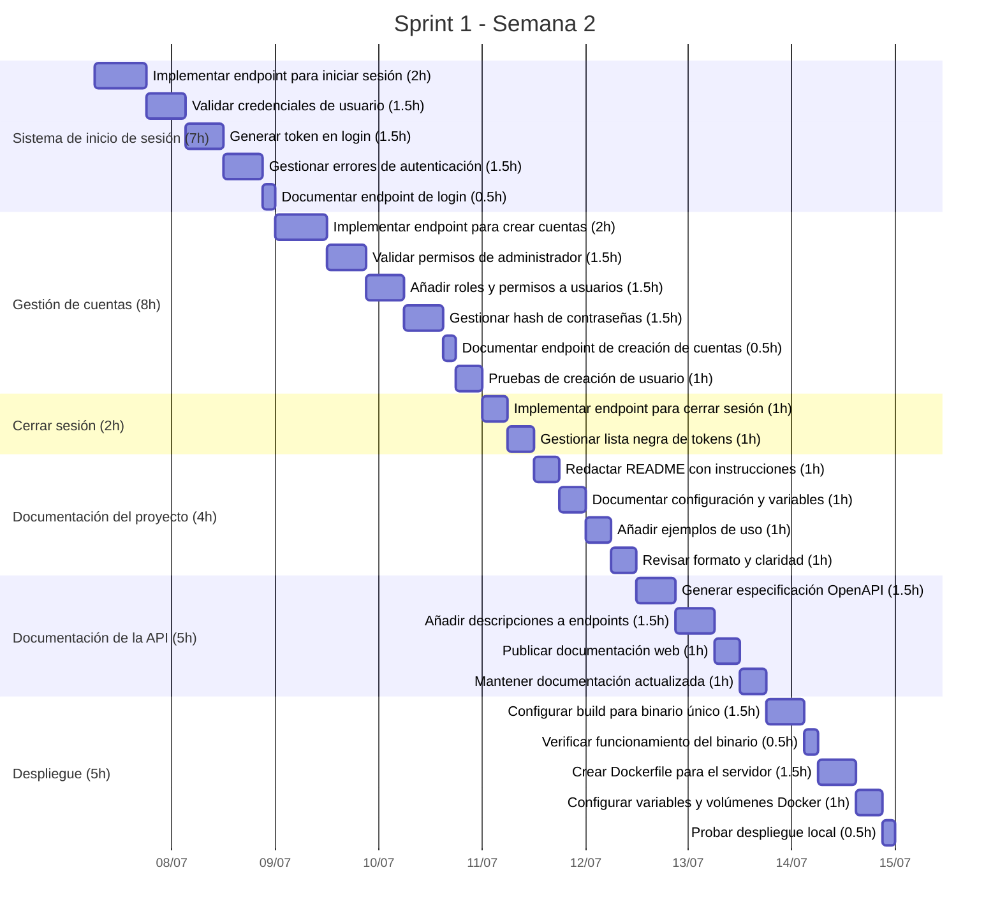
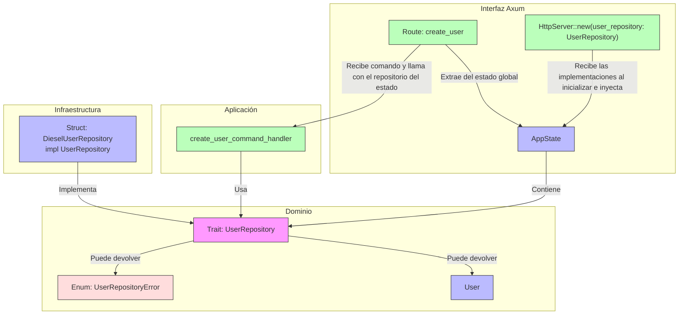
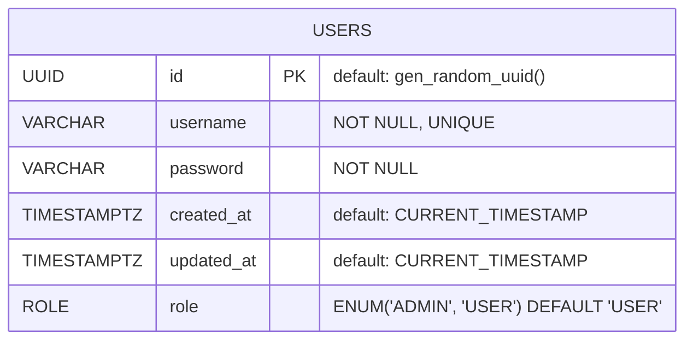

# Gantt diagrams for Sprint 1 tasks

```mermaid
gantt
    title Sprint 1 - Semana 1
    dateFormat DD-MM-YYYY
    axisFormat %d/%m
    todayMarker off
    tickInterval 1day
    section Infraestructura e inicialización (13h)
    Crear estructura base del proyecto en Rust (2h)    :project-base, 2025-06-30T00:00, 12h
    Configurar Axum y dependencias (2h)               :axum-config, after project-base, 12h
    Definir rutas y controladores básicos (2h)        :routes, after axum-config, 12h
    Implementar manejo de errores global (2h)         :error-handling, after routes, 12h
    Añadir middlewares (logging, CORS) (1.5h)         :middlewares, after error-handling, 9h
    Configurar variables de entorno (1.5h)            :env-config, after middlewares, 9h
    Documentar endpoints iniciales (1h)               :doc-endpoints, after env-config, 6h
    Pruebas de integración básicas (1h)               :integration-tests, after doc-endpoints, 6h
    section Base de datos (7h)
    Definir modelo de datos (2h)                      :db-model, after integration-tests, 12h
    Crear migraciones de BD (1.5h)                    :db-migrations, after db-model, 9h
    Implementar acceso a BD en Rust (2h)              :db-access, after db-migrations, 12h
    Pruebas de persistencia (1.5h)                    :db-tests, after db-access, 9h
    section Autenticación JWT (5h)
    Añadir y configurar librería JWT (1.5h)           :jwt-lib, after db-tests, 9h
    Generar y validar tokens JWT (1.5h)               :jwt-tokens, after jwt-lib, 9h
    Proteger endpoints con JWT (1h)                   :jwt-protect, after jwt-tokens, 6h
    Pruebas de autenticación JWT (1h)                 :jwt-tests, after jwt-protect, 6h
```

```mermaid
gantt
    title Sprint 1 - Semana 2
    dateFormat DD-MM-YYYY
    axisFormat %d/%m
    todayMarker off

    section Sistema de inicio de sesión (7h)
    Implementar endpoint para iniciar sesión (2h)     :login-endpoint, 2025-07-07T06:00:00, 12h
    Validar credenciales de usuario (1.5h)            :validate-creds, after login-endpoint, 9h
    Generar token en login (1.5h)                     :login-token, after validate-creds, 9h
    Gestionar errores de autenticación (1.5h)         :auth-errors, after login-token, 9h
    Documentar endpoint de login (0.5h)               :doc-login, after auth-errors, 3h

    section Gestión de cuentas (8h)
    Implementar endpoint para crear cuentas (2h)      :create-accounts, after doc-login, 12h
    Validar permisos de administrador (1.5h)          :admin-perms, after create-accounts, 9h
    Añadir roles y permisos a usuarios (1.5h)         :roles-perms, after admin-perms, 9h
    Gestionar hash de contraseñas (1.5h)              :password-hash, after roles-perms, 9h
    Documentar endpoint de creación de cuentas (0.5h) :doc-accounts, after password-hash, 3h
    Pruebas de creación de usuario (1h)               :user-tests, after doc-accounts, 6h

    section Cerrar sesión (2h)
    Implementar endpoint para cerrar sesión (1h)      :logout-endpoint, after user-tests, 6h
    Gestionar lista negra de tokens (1h)              :token-blacklist, after logout-endpoint, 6h

    section Documentación del proyecto (4h)
    Redactar README con instrucciones (1h)            :readme-install, after token-blacklist, 6h
    Documentar configuración y variables (1h)         :doc-config, after readme-install, 6h
    Añadir ejemplos de uso (1h)                       :doc-examples, after doc-config, 6h
    Revisar formato y claridad (1h)                   :doc-review, after doc-examples, 6h

    section Documentación de la API (5h)
    Generar especificación OpenAPI (1.5h)             :openapi-spec, after doc-review, 9h
    Añadir descripciones a endpoints (1.5h)           :openapi-desc, after openapi-spec, 9h
    Publicar documentación web (1h)                   :openapi-web, after openapi-desc, 6h
    Mantener documentación actualizada (1h)           :openapi-maintain, after openapi-web, 6h

    section Despliegue (5h)
    Configurar build para binario único (1.5h)        :build-binary, after openapi-maintain, 9h
    Verificar funcionamiento del binario (0.5h)       :verify-binary, after build-binary, 3h
    Crear Dockerfile para el servidor (1.5h)          :dockerfile, after verify-binary, 9h
    Configurar variables y volúmenes Docker (1h)      :docker-config, after dockerfile, 6h
    Probar despliegue local (0.5h)                    :docker-test, after docker-config, 3h
```

# Component's relationships diagram

```mermaid
flowchart TD
    subgraph Dominio
        TraitUserRepository["Trait: UserRepository"]
        UserRepositoryError["Enum: UserRepositoryError"]
        User
    end

    subgraph Infraestructura
        DieselUserRepository["Struct: DieselUserRepository<br/>impl UserRepository"]
    end

    subgraph Aplicación
        CreateUserHandler["create_user_command_handler<UR: UserRepository>"]
    end

    subgraph Interfaz Axum
        HttpServer["HttpServer::new(user_repository: UserRepository)"]
        RouteCreateUser["Route: create_user<UR: UserRepository>"]
        AppState["AppState<UR>"]
    end

    %% Relaciones
    
    DieselUserRepository -->|Implementa|TraitUserRepository

    CreateUserHandler -->|Usa| TraitUserRepository

    RouteCreateUser -->|Extrae del estado global| AppState
    RouteCreateUser -->|Recibe comando y llama con el repositorio del estado| CreateUserHandler

    TraitUserRepository -->|Puede devolver| UserRepositoryError
    TraitUserRepository -->|Puede devolver| User
    HttpServer -->|Recibe las implementaciones al inicializar e inyecta| AppState
    AppState -->|Contiene| TraitUserRepository

    %% Estilos
    classDef trait fill:#f9f,stroke:#333,stroke-width:1px;
    classDef struct fill:#bbf,stroke:#333,stroke-width:1px;
    classDef function fill:#bfb,stroke:#333,stroke-width:1px;
    classDef error fill:#fdd,stroke:#333,stroke-width:1px;

    class TraitUserRepository trait;
    class DieselUserRepository,AppState,User,NewUser,DBConnectionPool struct;
    class CreateUserHandler,RouteCreateUser,HttpServer function;
    class UserRepositoryError error;

```

```mermaid
erDiagram
    USERS {
        UUID id PK "default: gen_random_uuid()"
        VARCHAR username "NOT NULL, UNIQUE"
        VARCHAR password "NOT NULL"
        TIMESTAMPTZ created_at "default: CURRENT_TIMESTAMP"
        TIMESTAMPTZ updated_at "default: CURRENT_TIMESTAMP"
        ROLE role "ENUM('ADMIN', 'USER') DEFAULT 'USER'"
    }
```
