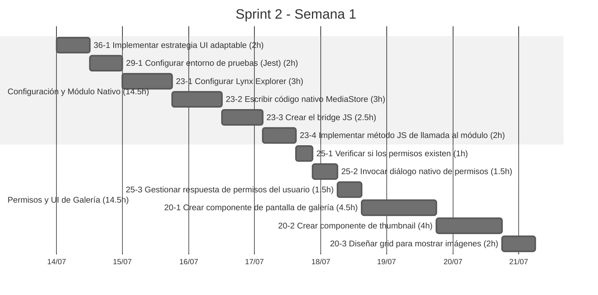
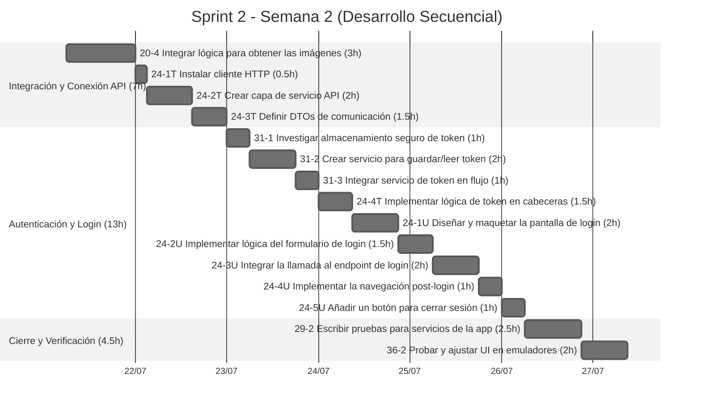

# Gantt diagrams
## Week 1

```mermaid
---
config:
  theme: neutral
---
gantt
    title Sprint 2 - Semana 1
    dateFormat  YYYY-MM-DD
    axisFormat %d/%m
    todayMarker off
    tickInterval 1day
    section Configuración y Módulo Nativo (14.5h)
    36-1 Implementar estrategia UI adaptable (2h)           :task-36-1, 2025-07-14T00:00, 12h
    29-1 Configurar entorno de pruebas (Jest) (2h)          :task-29-1, after task-36-1, 12h
    23-1 Configurar Lynx Explorer (3h)                      :task-23-1, after task-29-1, 18h
    23-2 Escribir código nativo MediaStore (3h)             :task-23-2, after task-23-1, 18h
    23-3 Crear el bridge JS (2.5h)                          :task-23-3, after task-23-2, 15h
    23-4 Implementar método JS de llamada al módulo (2h)    :task-23-4, after task-23-3, 12h
    section Permisos y UI de Galería (14.5h)
    25-1 Verificar si los permisos existen (1h)             :task-25-1, after task-23-4, 6h
    25-2 Invocar diálogo nativo de permisos (1.5h)          :task-25-2, after task-25-1, 9h
    25-3 Gestionar respuesta de permisos del usuario (1.5h) :task-25-3, after task-25-2, 9h
    20-1 Crear componente de pantalla de galería (4.5h)     :task-20-1, after task-25-3, 27h
    20-2 Crear componente de thumbnail (4h)                 :task-20-2, after task-20-1, 24h
    20-3 Diseñar grid para mostrar imágenes (2h)            :task-20-3, after task-20-2, 12h
```
## Week 2

```mermaid
---
config:
  theme: neutral
---
gantt
    title Sprint 2 - Semana 2 (Desarrollo Secuencial)
    dateFormat  YYYY-MM-DD
    axisFormat %d/%m
    todayMarker off
    tickInterval 1day
    section Integración y Conexión API (7h)
    20-4 Integrar lógica para obtener las imágenes (3h)   :task-20-4, 2025-07-21T06:00, 18h
    24-1T Instalar cliente HTTP (0.5h)                       :task-24-1a, after task-20-4, 3h
    24-2T Crear capa de servicio API (2h)                    :task-24-2a, after task-24-1a, 12h
    24-3T Definir DTOs de comunicación (1.5h)                :task-24-3a, after task-24-2a, 9h
    section Autenticación y Login (13h)
    31-1 Investigar almacenamiento seguro de token (1h)     :task-31-1, after task-24-3a, 6h
    31-2 Crear servicio para guardar/leer token (2h)        :task-31-2, after task-31-1, 12h
    31-3 Integrar servicio de token en flujo (1h)           :task-31-3, after task-31-2, 6h
    24-4T Implementar lógica de token en cabeceras (1.5h)    :task-24-4a, after task-31-3, 9h
    24-1U Diseñar y maquetar la pantalla de login (2h)       :task-24-1b, after task-24-4a, 12h
    24-2U Implementar lógica del formulario de login (1.5h)  :task-24-2b, after task-24-1b, 9h
    24-3U  Integrar la llamada al endpoint de login (2h)      :task-24-3b, after task-24-2b, 12h
    24-4U Implementar la navegación post-login (1h)          :task-24-4b, after task-24-3b, 6h
    24-5U  Añadir un botón para cerrar sesión (1h)            :task-24-5, after task-24-4b, 6h
    section Cierre y Verificación (4.5h)
    29-2 Escribir pruebas para servicios de la app (2.5h)   :task-29-2, after task-24-5, 15h
    36-2 Probar y ajustar UI en emuladores (2h)             :task-36-2, after task-29-2, 12h
```
