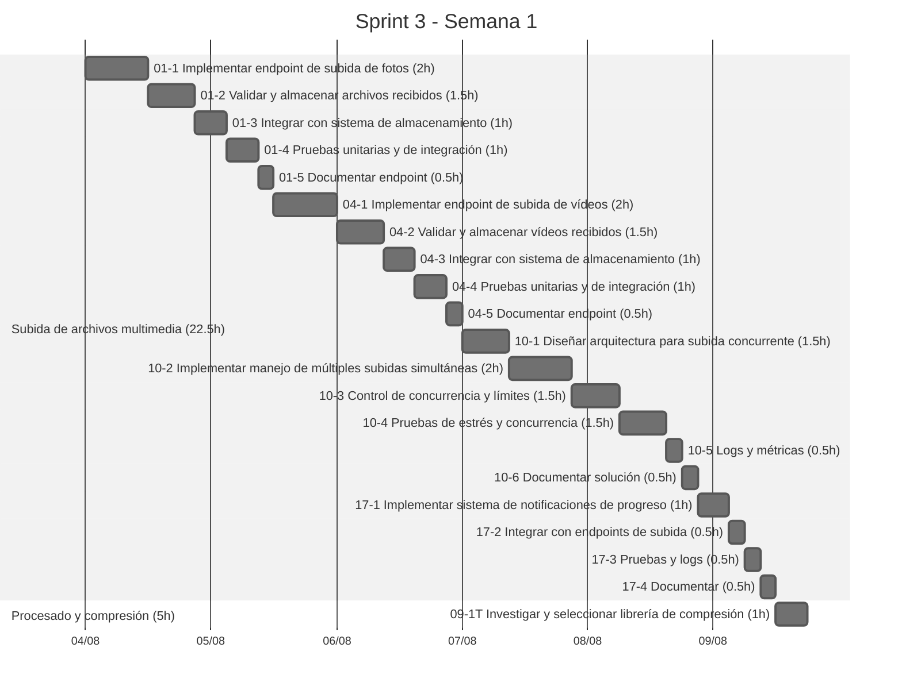
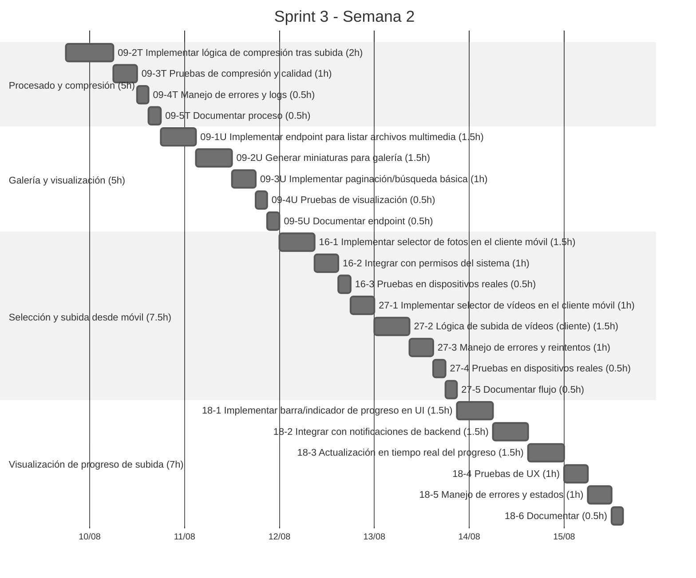
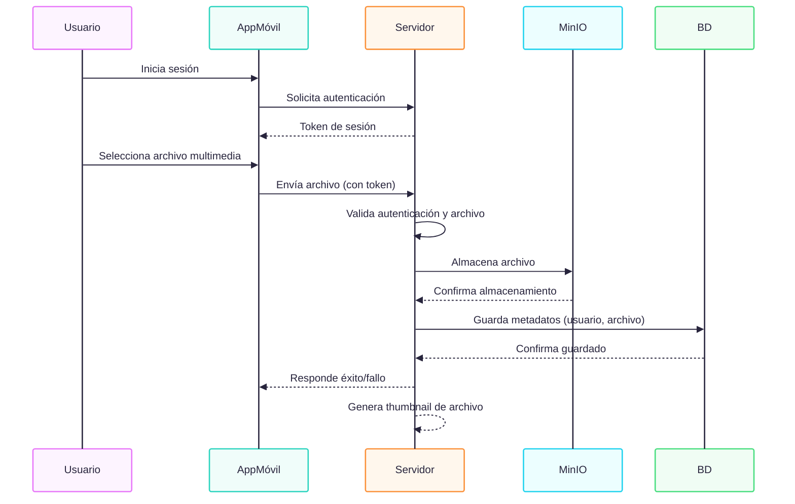
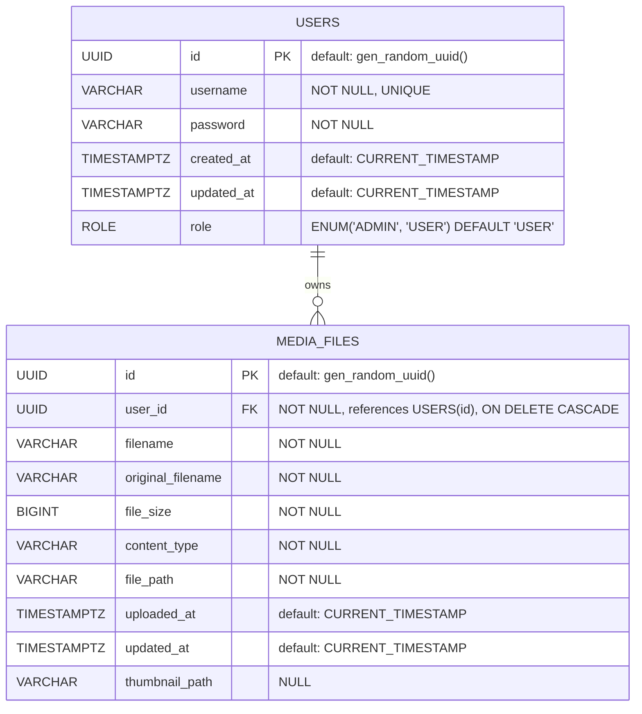

# Gantt diagrams
## Week 1

```mermaid
---
config:
  theme: neutral
---
gantt
    title Sprint 3 - Semana 1
    dateFormat  YYYY-MM-DD
    axisFormat %d/%m
    todayMarker off
    tickInterval 1day

    section Subida de archivos multimedia (22.5h)
    01-1 Implementar endpoint de subida de fotos (2h)         :task-01-1, 2025-08-04T00:00, 12h
    01-2 Validar y almacenar archivos recibidos (1.5h)        :task-01-2, after task-01-1, 9h
    01-3 Integrar con sistema de almacenamiento (1h)          :task-01-3, after task-01-2, 6h
    01-4 Pruebas unitarias y de integración (1h)              :task-01-4, after task-01-3, 6h
    01-5 Documentar endpoint (0.5h)                           :task-01-5, after task-01-4, 3h
    04-1 Implementar endpoint de subida de vídeos (2h)        :task-04-1, after task-01-5, 12h
    04-2 Validar y almacenar vídeos recibidos (1.5h)          :task-04-2, after task-04-1, 9h
    04-3 Integrar con sistema de almacenamiento (1h)          :task-04-3, after task-04-2, 6h
    04-4 Pruebas unitarias y de integración (1h)              :task-04-4, after task-04-3, 6h
    04-5 Documentar endpoint (0.5h)                           :task-04-5, after task-04-4, 3h
    10-1 Diseñar arquitectura para subida concurrente (1.5h)  :task-10-1, after task-04-5, 9h
    10-2 Implementar manejo de múltiples subidas simultáneas (2h) :task-10-2, after task-10-1, 12h
    10-3 Control de concurrencia y límites (1.5h)             :task-10-3, after task-10-2, 9h
    10-4 Pruebas de estrés y concurrencia (1.5h)              :task-10-4, after task-10-3, 9h
    10-5 Logs y métricas (0.5h)                               :task-10-5, after task-10-4, 3h
    10-6 Documentar solución (0.5h)                           :task-10-6, after task-10-5, 3h
    17-1 Implementar sistema de notificaciones de progreso (1h) :task-17-1, after task-10-6, 6h
    17-2 Integrar con endpoints de subida (0.5h)              :task-17-2, after task-17-1, 3h
    17-3 Pruebas y logs (0.5h)                               :task-17-3, after task-17-2, 3h
    17-4 Documentar (0.5h)                                   :task-17-4, after task-17-3, 3h

    section Procesado y compresión (5h)
    09-1T Investigar y seleccionar librería de compresión (1h) :task-09-1T, after task-17-4, 6h
```
## Week 2

```mermaid
---
config:
  theme: neutral
---
gantt
    title Sprint 3 - Semana 2
    dateFormat  YYYY-MM-DD
    axisFormat %d/%m
    todayMarker off
    tickInterval 1day

    section Procesado y compresión (5h)
    09-2T Implementar lógica de compresión tras subida (2h)    :task-09-2T, 2025-08-09T18:00, 12h
    09-3T Pruebas de compresión y calidad (1h)                 :task-09-3T, after task-09-2T, 6h
    09-4T Manejo de errores y logs (0.5h)                      :task-09-4T, after task-09-3T, 3h
    09-5T Documentar proceso (0.5h)                            :task-09-5T, after task-09-4T, 3h

    section Galería y visualización (5h)
    09-1U Implementar endpoint para listar archivos multimedia (1.5h) :task-09-1U, after task-09-5T, 9h
    09-2U Generar miniaturas para galería (1.5h)               :task-09-2U, after task-09-1U, 9h
    09-3U Implementar paginación/búsqueda básica (1h)          :task-09-3U, after task-09-2U, 6h
    09-4U Pruebas de visualización (0.5h)                      :task-09-4U, after task-09-3U, 3h
    09-5U Documentar endpoint (0.5h)                           :task-09-5U, after task-09-4U, 3h

    section Selección y subida desde móvil (7.5h)
    16-1 Implementar selector de fotos en el cliente móvil (1.5h) :task-16-1, after task-09-5U, 9h
    16-2 Integrar con permisos del sistema (1h)                :task-16-2, after task-16-1, 6h
    16-3 Pruebas en dispositivos reales (0.5h)                 :task-16-3, after task-16-2, 3h
    27-1 Implementar selector de vídeos en el cliente móvil (1h) :task-27-1, after task-16-3, 6h
    27-2 Lógica de subida de vídeos (cliente) (1.5h)           :task-27-2, after task-27-1, 9h
    27-3 Manejo de errores y reintentos (1h)                   :task-27-3, after task-27-2, 6h
    27-4 Pruebas en dispositivos reales (0.5h)                 :task-27-4, after task-27-3, 3h
    27-5 Documentar flujo (0.5h)                               :task-27-5, after task-27-4, 3h

    section Visualización de progreso de subida (7h)
    18-1 Implementar barra/indicador de progreso en UI (1.5h) :task-18-1, after task-27-5, 9h
    18-2 Integrar con notificaciones de backend (1.5h)        :task-18-2, after task-18-1, 9h
    18-3 Actualización en tiempo real del progreso (1.5h)     :task-18-3, after task-18-2, 9h
    18-4 Pruebas de UX (1h)                                   :task-18-4, after task-18-3, 6h
    18-5 Manejo de errores y estados (1h)                     :task-18-5, after task-18-4, 6h
    18-6 Documentar (0.5h)                                   :task-18-6, after task-18-5, 3h
```

## Media upload flow

```mermaid
---
config:
  theme: redux-color
---
sequenceDiagram
    participant Usuario
    participant AppMóvil
    participant Servidor
    participant MinIO
    participant BD
    Usuario->>AppMóvil: Inicia sesión
    AppMóvil->>Servidor: Solicita autenticación
    Servidor-->>AppMóvil: Token de sesión
    Usuario->>AppMóvil: Selecciona archivo multimedia
    AppMóvil->>Servidor: Envía archivo (con token)
    Servidor->>Servidor: Valida autenticación y archivo
    Servidor->>MinIO: Almacena archivo
    MinIO-->>Servidor: Confirma almacenamiento
    Servidor->>BD: Guarda metadatos (usuario, archivo)
    BD-->>Servidor: Confirma guardado
    Servidor-->>AppMóvil: Responde éxito/fallo
    Servidor-->>Servidor: Genera thumbnail de archivo
```

```mermaid
erDiagram
    USERS {
        UUID id PK "default: gen_random_uuid()"
        VARCHAR username "NOT NULL, UNIQUE"
        VARCHAR password "NOT NULL"
        TIMESTAMPTZ created_at "default: CURRENT_TIMESTAMP"
        TIMESTAMPTZ updated_at "default: CURRENT_TIMESTAMP"
        ROLE role "ENUM('ADMIN', 'USER') DEFAULT 'USER'"
    }

    MEDIA_FILES {
        UUID id PK "default: gen_random_uuid()"
        UUID user_id FK "NOT NULL, references USERS(id), ON DELETE CASCADE"
        VARCHAR filename "NOT NULL"
        VARCHAR original_filename "NOT NULL"
        BIGINT file_size "NOT NULL"
        VARCHAR content_type "NOT NULL"
        VARCHAR file_path "NOT NULL"
        TIMESTAMPTZ uploaded_at "default: CURRENT_TIMESTAMP"
        TIMESTAMPTZ updated_at "default: CURRENT_TIMESTAMP"
        VARCHAR thumbnail_path "NULL"
    }

    USERS ||--o{ MEDIA_FILES : "owns"
```
